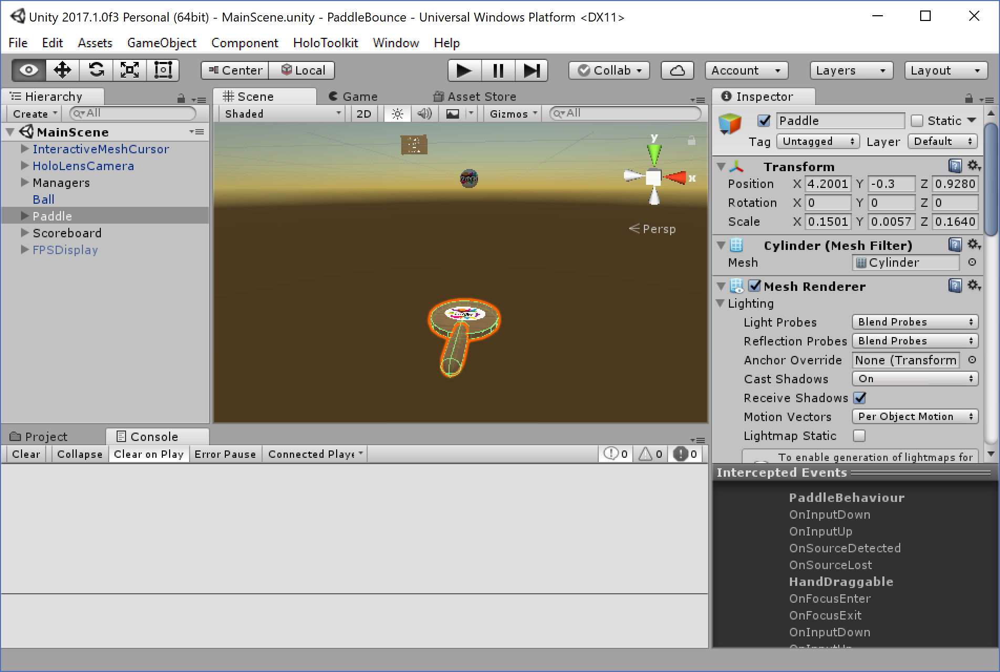
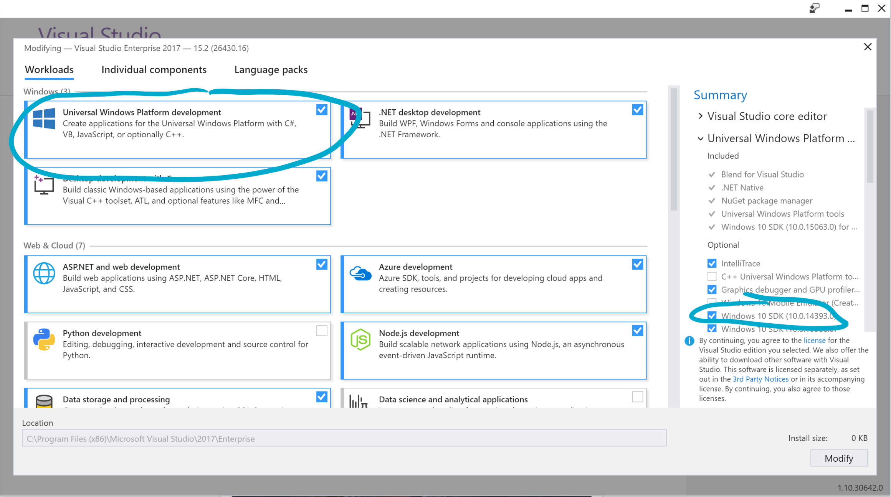
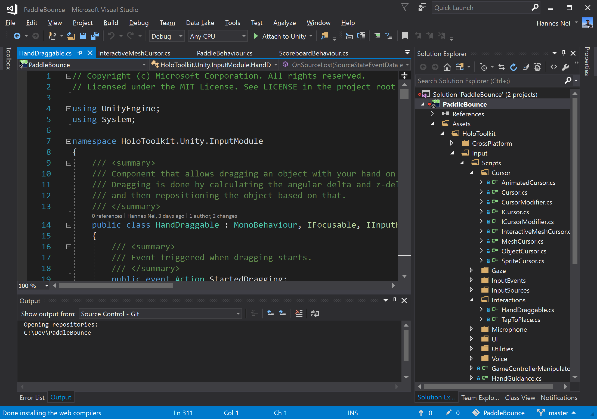
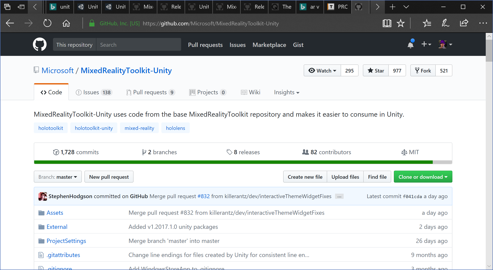
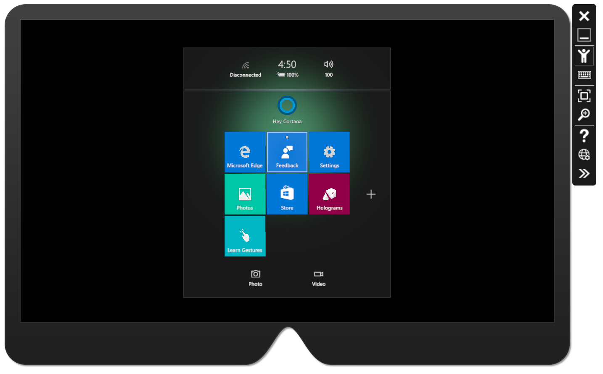

To start off with developing our app, we need some tooling. We’ll have a quick
look at what I used for Paddle Bounce. TLDR: You can follow the instructions in
the Windows Mixed Reality dev center for setting up your dev environment:
<https://developer.microsoft.com/en-us/windows/mixed-reality/install_the_tools>

We’ll use Unity3d, Windows SDK, Visual Studio, the Mixed Reality Toolkit and an
actual device. If you use the emulator, I highly recommend getting a gamepad to
control it. Using the mouse and keyboard can be finicky.

You might notice that the tools and terminology refers to immersive headsets and
HoloLens. Immersive headsets are VR devices, and HoloLens is an AR device.
Windows Mixed Reality is the technology that lets you write UWP apps that works
on both kinds of devices. A full discussion is available here, and well worth
reading:
<https://developer.microsoft.com/en-us/windows/mixed-reality/mixed_reality>

Unity
=====

Much of Mixed Reality apps are currently built using Unity3d. There’s a few
benefits to using Unity:

1.  Very mature runtime and tooling. It’s been around for ages now, and the
    general quality, stability and ease of use has improved greatly over the
    years.

2.  Cross-platform targeting. You can re-use your code for apps targeting
    Windows (HoloLens, Xbox, UWP or standalone Windows desktop etc.) as well as
    other platforms like Tizen (Samsung TVs), PlayStation, iOS and Android.

3.  Unity has a great ecosystem in it’s community, with good engagement on the
    forums, and a rich set of tutorials to help you get unstuck with difficult
    issues.

4.  A well-populated asset store. One of the hardest things for a developer
    looking at developing games or other immersive 3d apps is getting access to
    assets like 3d models. While you can build these yourself, 3d modeling and
    creating textures requires a set of skills that takes just as long to
    develop as writing code does. Many of the assets you need, can be had from
    the asset store, allowing you to focus on the coding aspect of your app.

It’s important to realize that when dealing with Unity, versions matter! Unity
bundles the runtime and built-in assets that your app use with the editor.
Upgrading the editor, does so for all three these components. This can introduce
breaking changes in your app, for your code and any 3rd party code you use.
Luckily, most of the third parties will publish their code in asset packages as
regular script, rather than pre-compiled DLLs (plugins). If the author hasn’t
updated their code for a new version, you can probably fix it yourself. For this
tutorial, I’ll be using version 2017.1. Note that this version does not yet
support the new occluded Mixed Reality headsets, that support is in 2017.2.

Unity has a free personal version for individuals and companies that aren’t yet
making lots of money. It locks the splash screen to the Unity logo though, so if
you want to update that, you’ll need to spring for a pro license.

Get unity from here: <https://unity3d.com/get-unity/download>

Windows SDK
===========

Mixed Reality apps are just regular UWP apps, and use the same Windows SDK as
other UWP apps. This means that you will need access to the Windows SDK on the
machine that you build your app on. The SDK is free, and will be installed using
Visual Studio. There are also emulators for the HoloLens and you can simulate an
occluded headset in the Mixed Reality Portal. At this point, HoloLens uses
version 10.0.14393 of Windows, so make sure you install that version of the SDK.
You can install other versions next to it, and it doesn’t need to match the
version of Windows you’re using to develop. You can run apps built with a newer
version of the SDK on the HoloLens, but you’ll need to be mindful of using
features that aren’t supported on the device. You can use runtime feature
checking to do that.

Install the SDKs from the Visual Studio 2017 installer, by selecting the UWP
workload, and selecting the relevant SDK version in the optional section.

Visual Studio
=============

Visual Studio 2017 is a comprehensive IDE for working with all kinds of apps and
programming languages. When you develop an app using Unity, you’ll typically
edit the scene in the editor, and your code in Visual Studio. You’ll also use it
to build UWP packages for the store, and deploy and debug your code on a device
or emulator. While all this can be done using command line utilities and the
device’s dev portal, Visual Studio makes it much easier. For this tutorial, I’m
using Visual Studio 2017 Enterprise. The free Community Edition is available for
personal use, and small companies. It has the same features as the Pro version.
Visual Studio Code is a different editor altogether: it is lightweight and fast,
and I use it for quick edits of particular files outside of my project.

When you install Visual Studio, you’ll be asked which workloads you’d like to
install. At a minimum you should pick the Universal Windows Platform development
workload, and the Game Development with Unity. Ensure that version 10.0.14393 of
the Windows SDK is installed. You don’t need the optional Unity Editor 5.6
component, as you’ll be installing a different version manually. Unity versions
are typically installed side-by-side, so there’s no harm in installing it. Also
make sure the Visual Studio tools for Unity component is selected, as it syncs
between the Unity Editor and Visual Studio. You won’t need all the emulators and
older SDKs, and they can take up quite a bit of space.

You can download the Visual Studio installer from here:
<https://www.visualstudio.com/downloads/>

Mixed Reality Toolkit
=====================

This is what was previously known as the Holo-toolkit. It was renamed as part of
an update to include support for the occluded immersive headsets (VR) that
support Windows 10 Mixed Reality. The toolkit is split into the base toolkit
(MixedRealityTookit) which contains generic components, and the
MixedRealityTookit-Unity, which contains the base and components specific to
Unity development. You only need the Unity version for this tutorial series.

The toolkit contains several components that are useful for developing Mixed
Reality apps for both HoloLens and immersive headsets.

The toolkit is an open source program, contributed to by Microsoft and the wider
community. It contains reusable building blocks, utilities for use in Unity, and
a rich set of examples. It is important to only use releases that support the
version of Unity that you are using. Pre-built releases can be found in the
github repository, with a tag for it’s release version. You can find both
releases for the current version of Unity and beta versions.

The Mixed Reality Toolkit’s version number on releases matches that of the
current supported version of Unity. This means that version 1.**2017.1**.0 will
be for version 2017.1 of Unity. We can find the releases here:
<https://github.com/Microsoft/MixedRealityToolkit-Unity/releases>

Emulator
========

Microsoft provides a free emulator that you can use to test your app. The
emulator has a stand-alone installer, that will add the necessary bits to your
PC. Install this once you’ve got everything else. It also uses Hyper-V so your
machine needs to support Hyper-V and have it enabled.

The emulator lets you do cool things like simulate a room that you’re in. You
should try to get a gamepad if you plan to work in the emulator. The Microsoft
Xbox One controller works well for this.

You can download the emulator from here along with setup instructions:
<https://developer.microsoft.com/en-us/windows/mixed-reality/using_the_hololens_emulator>

Note that if you’re using a device with multiple GPUs, like the SurfaceBook, you
might have to change your settings in the Hyper-V manager, you might have to
disable using RemoteFX with the GPU. You can do this by opening Hyper-V manager,
and checking in the Hyper-V settings page.

Next Steps
==========

Once you’ve got all of this installed, we can finally get started. Time for Part
2: Hello Paddle Bounce!
