In this post we’ll get started by doing the equivalent of a Hello World app for
our HoloLens. We’ll build a simple app with a sphere hanging in mid-air, which
we’ll deploy to our HoloLens. Let’s get started!

File -\> New Project
====================

We’ll start out by launching the Unity Editor. The first screen is a welcome
screen that lists any projects we’ve recently opened, and a button to create a
new project.

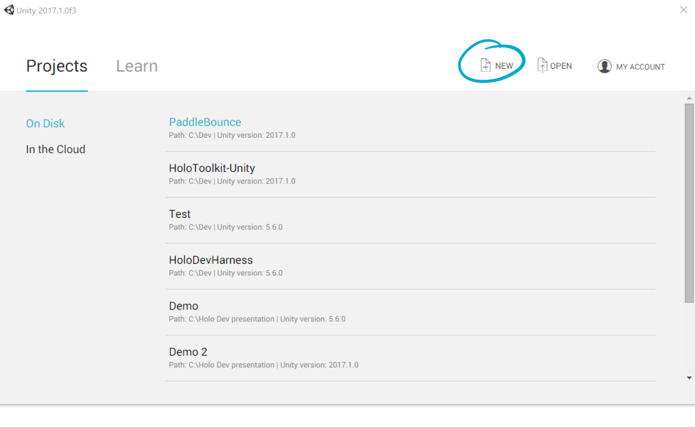

You’ll notice that the UI displays the version of the editor last used to open
the project. Opening the project in a newer version will migrate the project.
This is not reversible. As discussed in Part 1, this may break things so make
sure you’ve got your project in source control.

Let’s click the New button.

Now we’ll pick a name and a path for our project before clicking Create Project

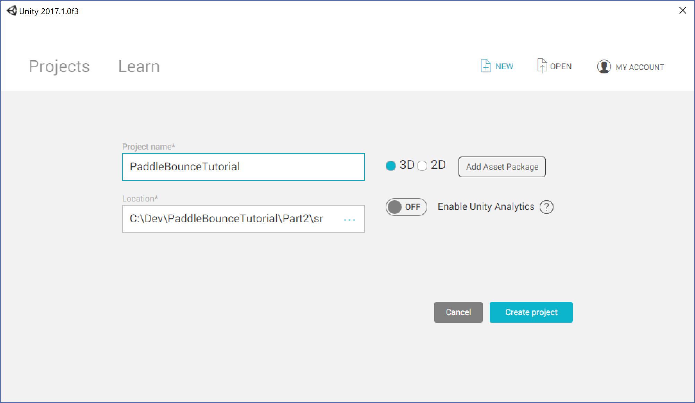

Clicking Create Project will launch the Unity Editor, and load this project. If
the editor crashes immediately after clicking create, check your graphics
drivers. In the case of my SurfaceBook running Windows Insider builds, I had to
go to nVidia’s driver page and manually download and install the latest drivers.
This should be your first port of call if the editor crashes on load.

Once the editor loads, we’ll be presented with this screen:

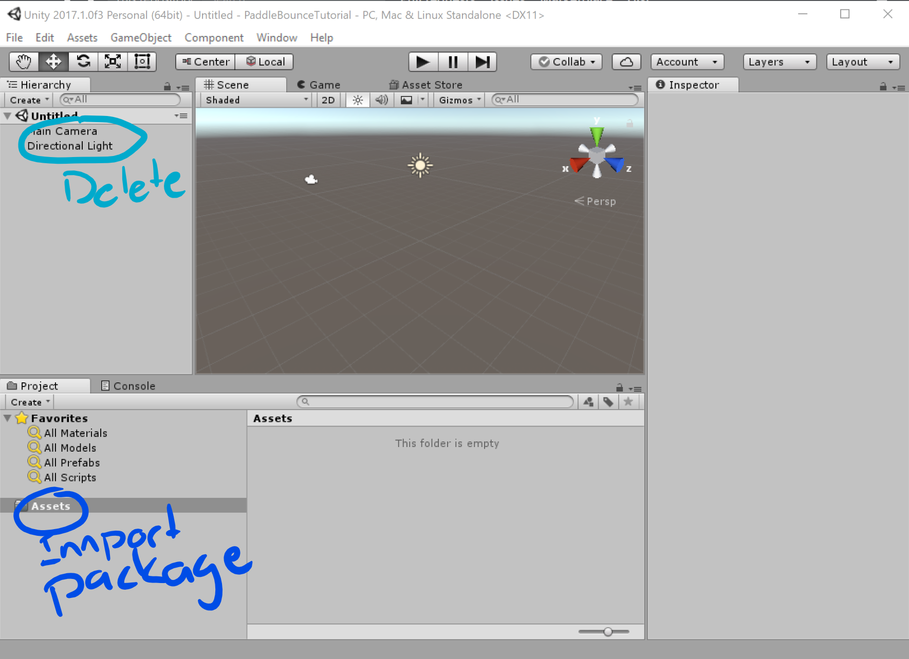

The toolkit provides us with a handy camera to use, and we don’t need a light.
Delete them by right clicking on them in the Hierarchy view, and clicking delete
in the context menu.

Import Mixed Reality Toolkit
============================

Next, we want to import the Mixed Reality Toolkit. We can download it form the
releases here:
<https://github.com/Microsoft/MixedRealityToolkit-Unity/releases>. I’m using
version 1.2017.1.0. It’s important to only use releases that match the version
of Unity that you’re using, as they will rely on APIs provided by the Unity
Runtime, and hooks in the editor. If you upgrade your version of Unity, you’ll
also need to upgrade your version of the toolkit. This can be non-trivial.

To import the package, right click the Assets folder in the project view, Click
Import Package -\> Custom Package… and provide the path to your downloaded
unitypackage file. Make sure everything is selected in the little import window
that opens and click import. The next part can take a few minutes as everything
gets pulled in. When it’s complete, your screen should now look like this:

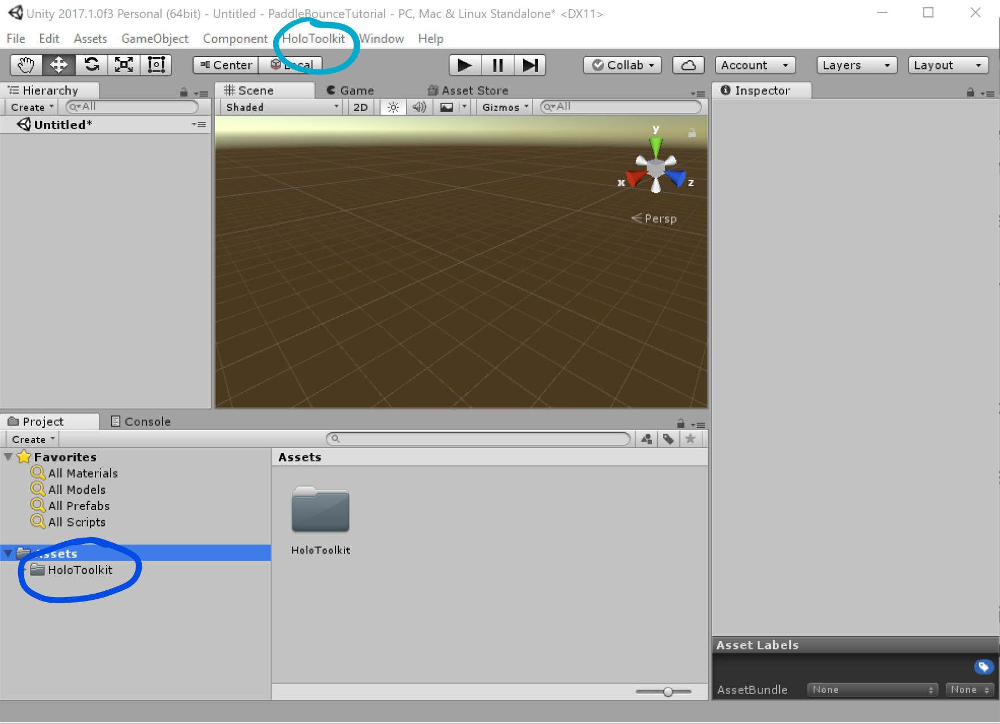

Notice the new HoloToolkit item in the menu, and the HoloToolkit folder in the
Assets folder in the project view. These will be renamed in a future release,
introducing breaking changes. It is currently maintained to support developers
transitioning.

We’ll now use the options in the HoloToolkit menu item to help us set up our
project. Click on the HoloToolkit item, and click on Configure:

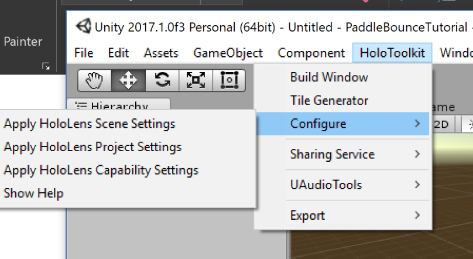

We’ll start with the scene settings. Click on a setting for a description
indicating what it does. Select all the items and click Apply to continue.

Now do the same for the Project Settings. Allow it to reload the project when
prompted. You’ll be asked to save your scene. Select yes. The dialog opens in
the Assets folder. You’ll see the holotoolkit folder there. Create a new folder
for you own project’s assets. It is useful to give it the same name as your
project. Sometimes you can have many different asset packages, each with its own
folder. Call your scene Main and continue. The editor will reload.

Lastly, apply the capability settings. Enable Microphone and spatial perception.
There are many other capabilities that can be enabled for a UWP app, but these
are the basic ones you’ll need.

Create the Scene
================

Now we’ll add a camera to our scene. Do this by expanding the Assets -\>
HoloToolkit -\> Input -\> Prefabs folders in the project view, and drag the
HoloLensCamera prefab onto the Main scene object in the Hierarchy view:

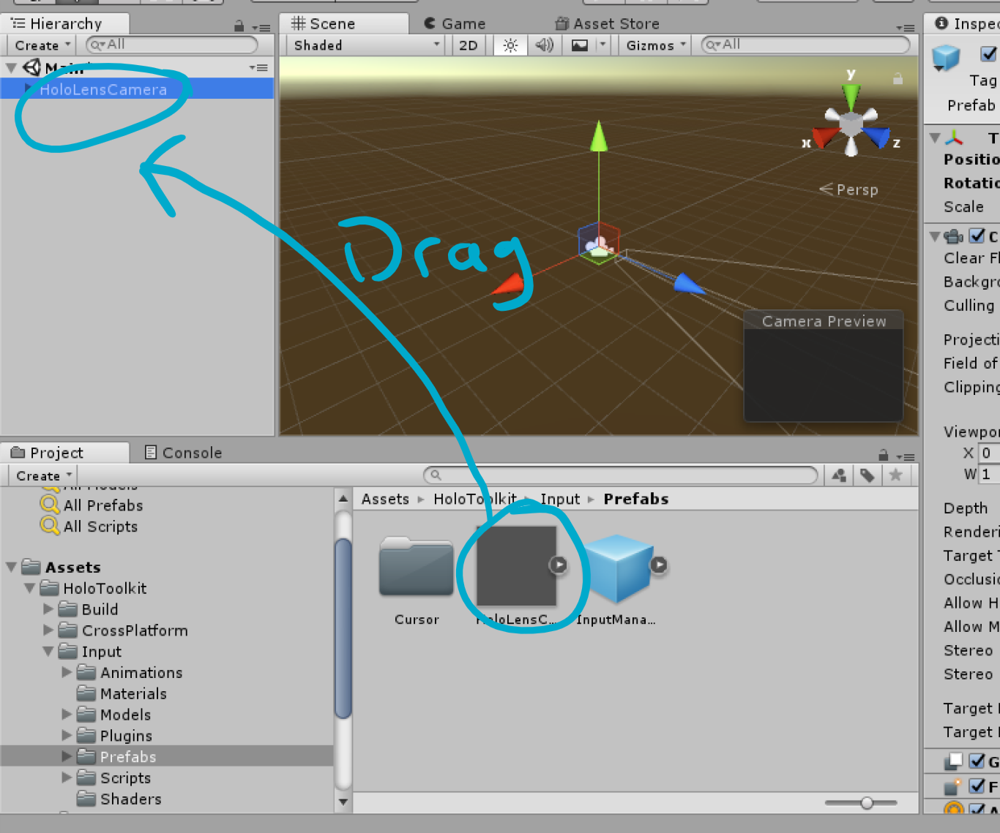

Next, we’ll add a ball to the scene. We do this by right clicking on the scene,
and in the context menu click GameObject -\> 3d Object -\> Sphere.

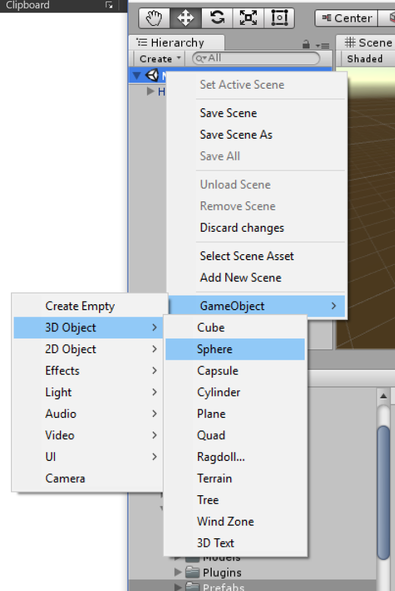

Now we’ll right click on the Sphere in the Hierarchy view, and click Rename to
name it Ball.

Your window should now look like this:

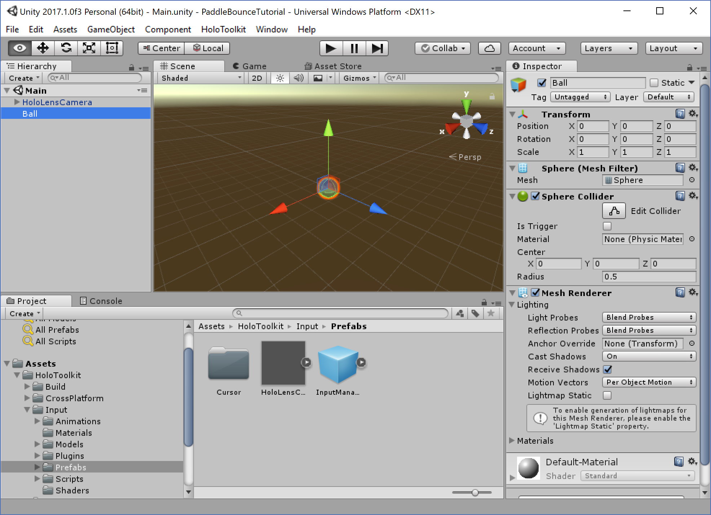

OK, you might be wondering what we just did and why. Time for a bit of theory.
The Hierarchy tree represents the collection of objects that we’ve got in our
app. You can think of it as being equivalent to the DOM of a web page, with the
scene being the root element. Each one of these objects is a
[GameObject](https://docs.unity3d.com/Manual/class-GameObject.html), which is
the base object for all Unity objects in a scene. When the Unity Runtime
executes, it will use these objects to determine what to render, and how to do
so. The camera represents the window into the scene. Whatever it can see is what
will be rendered in your app. Prefabs are pre-configured collections of game
objects and associated components. Using prefabs makes it easy for us to have
multiple instances of something in our app. You can think of a prefab as a class
or template, and adding it to a scene creates an instance of it. The camera
prefab we dragged in has been preconfigured for hololens. Some tutorials will
have you manually configure these fields instead of using the Holtoolkit camera
prefab.

Switching between the camera and ball, changes the content of the Inspector
window on the right. This window will show you the details of a game object.
Each section is a different component. You can add multiple components to a
gameobject. A [component](https://docs.unity3d.com/Manual/Components.html) can
be a script, a physics component, a texture, a rendering mesh, or more. They are
modules of functionality that does something specific to that component.

Notice the values for the Transform component in the inspector view when you
select the camera.

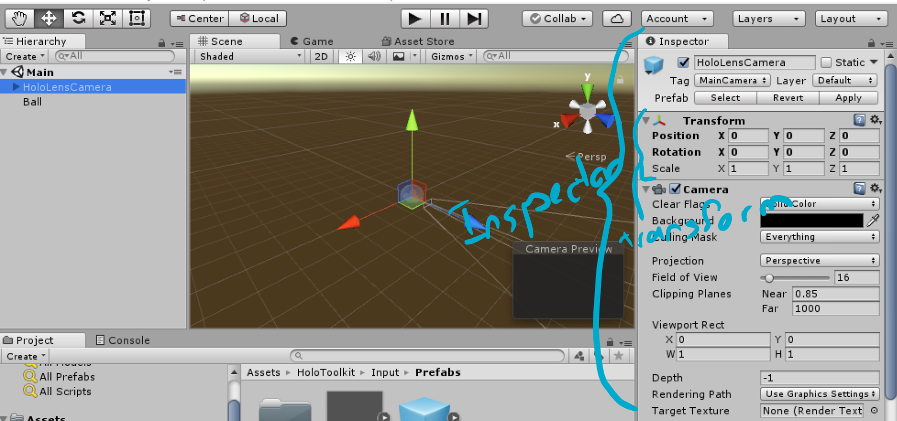

The transform component is what determines the size, position and rotation of
the object in our scene. For the camera we want the position to be set to 0,0,0
(x,y,z). This will place the camera, which is our head, in the middle (origin)
of the scene.

Now let’s select the ball and set its position in the transform to 0,0,1. This
will place the ball 1 meter in front of us. In a Unity-based Hololens project 1
unit is analogous to 1 meter in the real world. The x axis is left-right, y axis
is up-down and the z axis is closer-further. Lastly, we’ll change the scale
values to be 0.04, 0.04, 0.04. This will shrink the ball’s diameter to 4
centimeters.

Let’s see what this looks like. Click the play button at the top of the screen
to preview your app. This will launch the app in the editor, and show us what
the camera sees.

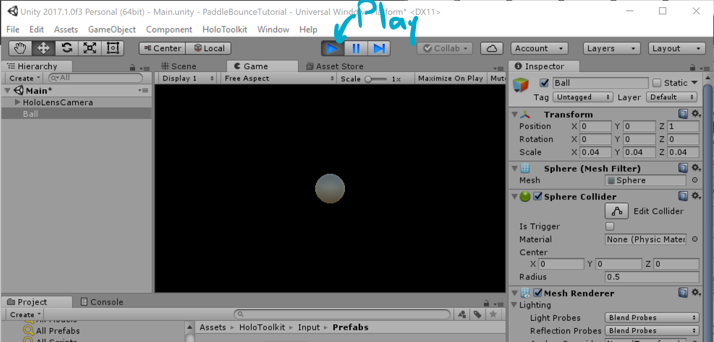

You should see a simple sphere hanging in mid-air.

Build the player
================

Now we’ll deploy our app to the HoloLens, for a real-world preview of what’s to
come. Press ctrl-S to save you scene, or select the option from the File menu
item at the top.

Next click File -\> Build Settings…

In the new Window

1.  click Add Open Scenes

2.  change the Target Device to Hololens

3.  check Unity C\# Projects

4.  click Build

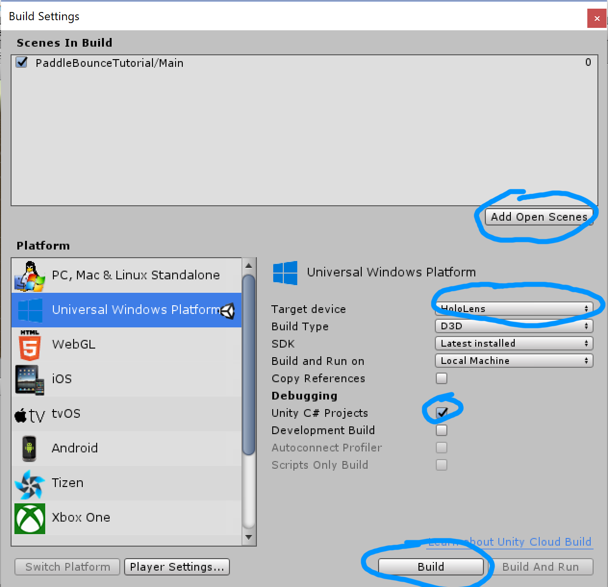

Unity will ask you for an output path, with a dialog open at the root of your
project. Create a folder here called Builds, and select that. If you intend on
building for multiple platforms, you will want to create another folder beneath
that for your output. If you use source control, you might want to exclude this
path. We’ll treat this folder as generated output, and only change things
directly in here when you create packages to upload to the store.

At this point Unity will now create a UWP solution for your app. This solution
is referred to as the player. If you build for other platforms like iOS, the
player will be an xcode project. This project will contain

1.  the Unity runtime DLLs and any plugins you’ve imported for UWP. The Copy
    References checkbox controls whether these are copied to your output, or
    referenced from your editor’s installation path.

2.  a compressed binary containing all the assets like 3d models, textures and
    sounds that your app uses in the scenes you’ve included. Unused assets in
    your project view are not included.

3.  if you checked the Unity C\# Projects box, unity will create a separate C\#
    project containing all the scripts from your app and the toolkit. This will
    be referenced from the main project, allowing you to place breakpoints in
    the code to debug the app. Otherwise, the scripts will be compiled into a
    DLL and bundled with the Unity Runtime.

At the end of the build, a File Explorer window will open, at the root of your
project. Ignore the solution file in here (that’s for the Unity project, not
your UWP project). Navigate into the Builds folder, and open the solution in
there with Visual Studio 2017. Each time you change the content of the app’s
scene, you’ll have to rebuild this solution. Unity usually won’t overwrite
content that hasn’t changed in the editor, so subsequent builds are faster. Your
project files will also not be overwritten unless you’ve changed project
settings. Script files in the Assembly-CSharp project are references to your
original source files, so changing them here will change them there as well. If
you do need to change anything in this project, write a script to easily
reproduce those changes if Unity overwrites them. Sometimes you might also run
into errors with the generated content, that can only be fixed by deleting the
solution and starting fresh. This is especially true if you’ve upgraded the
Unity version.

To the HoloLens!
================

Your Visual Studio solution should look like this:

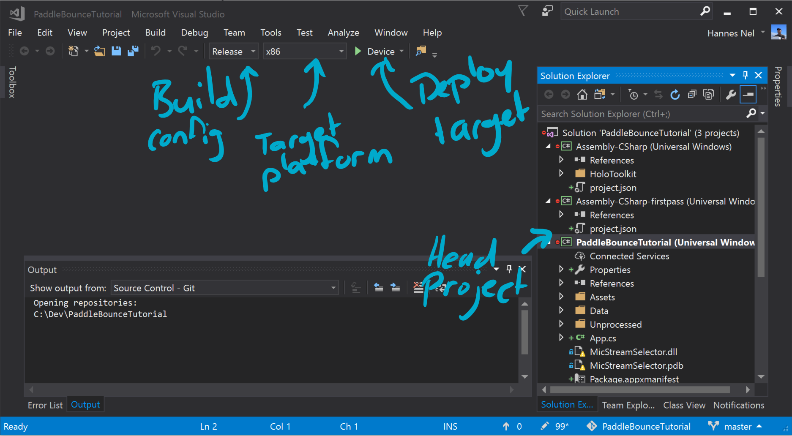

Make sure you’ve got the PaddleBounceTutorial project selected.

We’ll now change the Build Config to Release. The debug option is necessary to
load symbols and enable debugging, but dramatically drops the framerate. The
master option is the same as release, except that it enables the Dot Net Native
tool chain, which compiles your IL .Net code to Native code. This is required
for uploading an app to the store, but takes a fair bit longer to compile, so
only test it occasionally.

Change the Target Platform to x86. HoloLens uses a 32bit Atom processor. If you
forget to change this, you might get deployment errors alluding to image
formats, or not finding DLLs from the Mixed Reality toolkit.

Change the Deployment target to Device, if you’ve got a HoloLens plugged into
USB. You can also use the Remote Machine option to deploy over wi-fi using the
device’s IP address. This is much slower than over USB, but can be handy. If you
installed the HoloLens emulator, you’ll also find it in the list. Deploying to
the emulator will start the emulator up for you. This takes a while, but only
needs to be done once. You don’t need to turn the emulator off in between
deployments.

Now click the play button. If it’s the first time you deploy to your device, you
might need to pair it first. Visual Studio will pop up a window for you to enter
in the 6 digit pin required to pair the device. Click the link to see the full
documentation for enabling dev mode on your device, and obtaining the pin link.
You can get the pin link by using your HoloLens to go to Settings -\> Update &
Security -\> Developer Mode. Enable it, and then click the pair button. Enter
the pin into Visual Studio, and click the Done button on the device. Visual
Studio will continue deploying the app to your device, and enter debug mode:

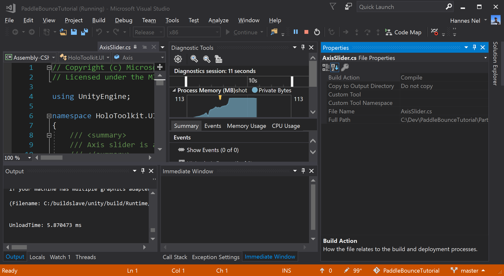

On your device, you’ll see the Unity splash screen appear, followed by a sphere
hanging in mid-air. You can walk around this sphere and observe how still it
stays. If you get closer than 85cm from it, the sphere will disappear. Click the
stop button in Visual studio to stop debugging.

Congratulations, you’ve built and deployed your first HoloLens app!

A note on Source Control
========================

At this point you’ll probably want to commit your project to your source control
system. If you’re using Git, and you sued the git desktop client to create your
repository you’ll get the option to import a unity-specific ignore file. One of
the entries is for a Builds directory, as you probably don’t need to commit the
generated player content. There’s also a few other entries for directories that
gets created in the project by Unity, like the Library directory, and many
metadata files.

However, this ignore assumes that your unity project is in the root of your
repo. If your Unity project is deeper than that, you might need to update the
ignore file.

In the case of this tutorial series for instance, I have the following in my
gitignore file:

>   \*\*/PaddleBounceTutorial/[Ll]ibrary/

>   \*\*/PaddleBounceTutorial/[Tt]emp/

>   \*\*/PaddleBounceTutorial/[Oo]bj/

>   \*\*/PaddleBounceTutorial/[Bb]uild/

>   \*\*/PaddleBounceTutorial/[Bb]uilds/

>   \*\*/PaddleBounceTutorial/Assets/AssetStoreTools\*

I had to prepend the default library entries with *\*\*/PaddleBounceTutorial* to
make git ignore them correctly. If you’ve already committed the additional
files, you’ll have to manually remove the directories from your repo, and clear
the cache. Use the command *git rm –cached {directoryname}* After fixing this up
in my tutorial, my commit went from 4600 files to 1000 files, so it’s well worth
making sure you’re doing it right.

Summary
=======

In summary, we’ve seen how to:

1.  Pull in the Mixed Reality Toolkit

2.  Setup our project settings

3.  Create some game objects

4.  Build a UWP player

5.  Deploy to our HoloLens

In the next part, we’ll add a paddle and a simple game mechanic to start
playing.
