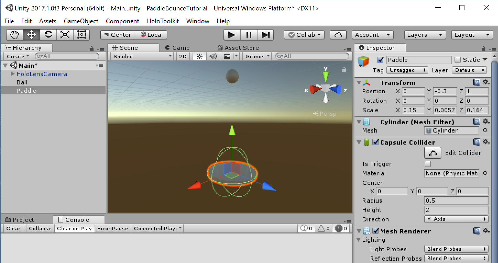
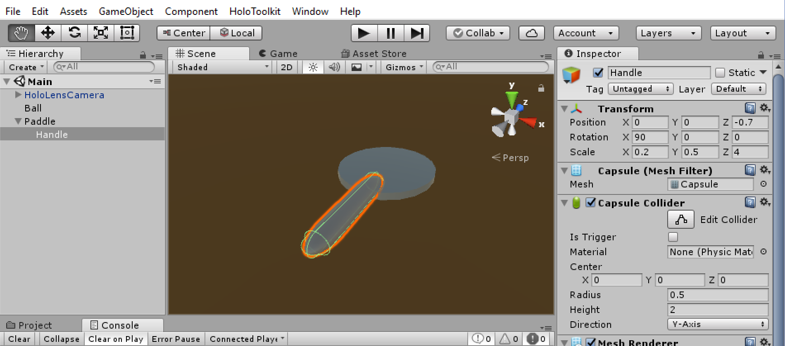
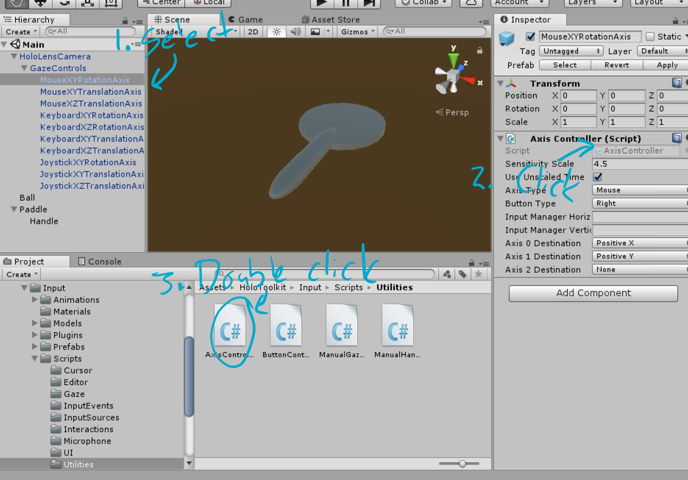
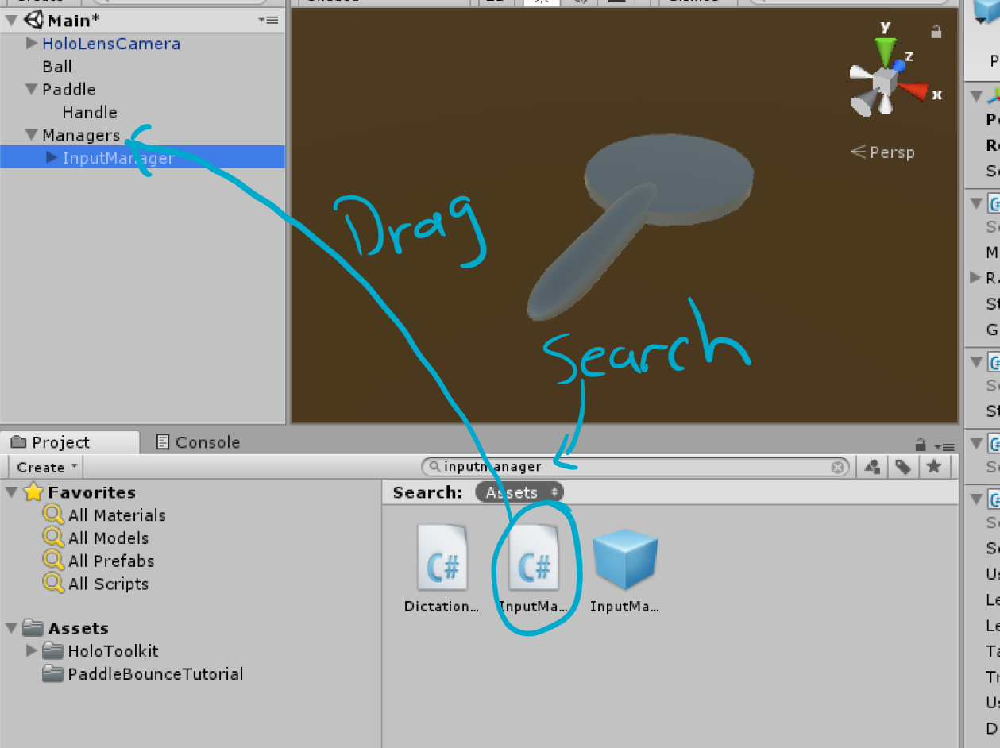
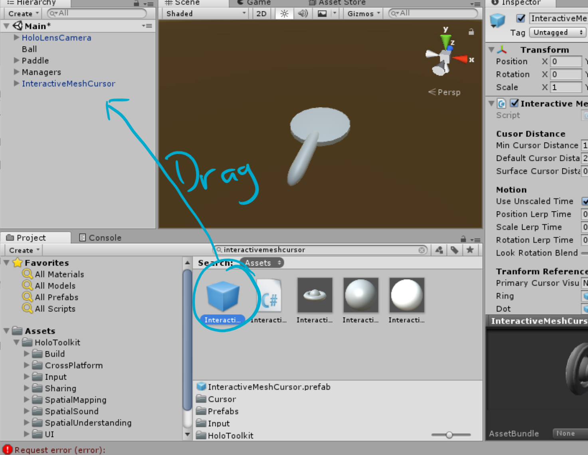
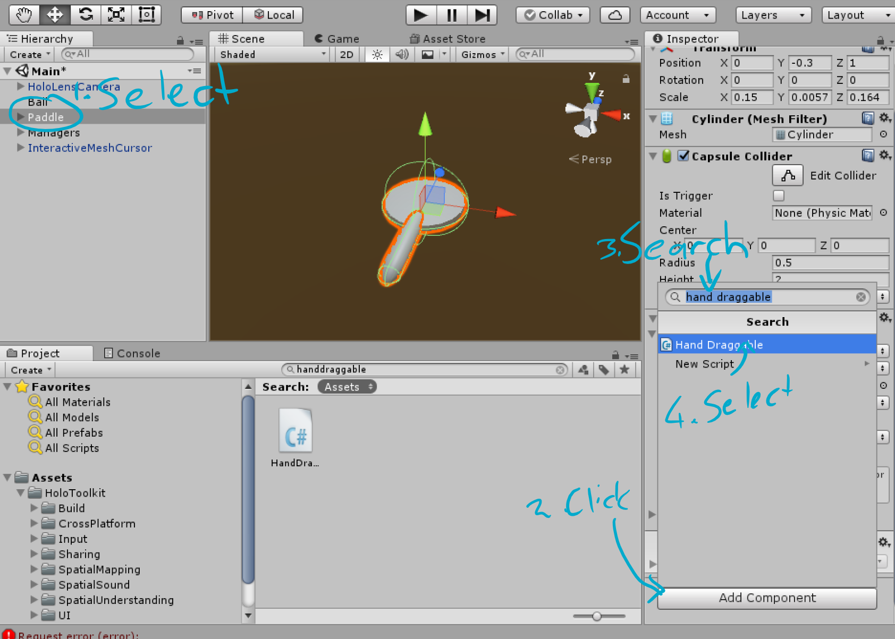
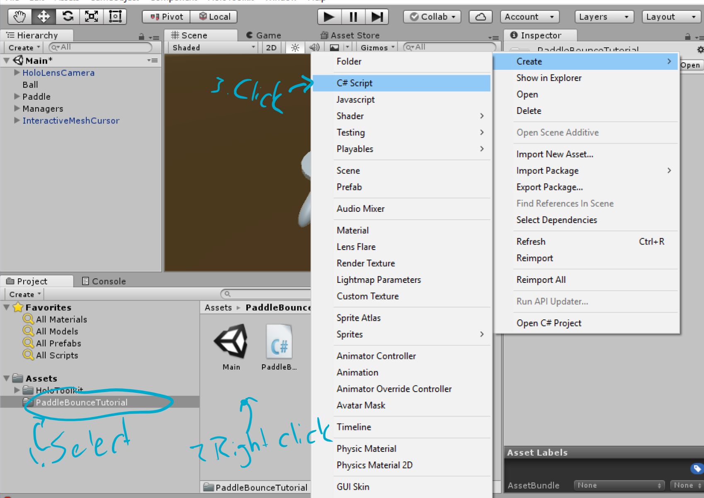

At this point you should now have a HoloLens app with a sphere hanging in
mid-air. Not particularly exciting, and definitely a far-cry from a top100 app
store title. Let’s see how to make it a bit more interactive, and inch closer to
our goals.

Building a paddle
=================

We can’t have a game called paddle bounce, without a paddle. We have two options
here: we can either import a paddle built for us by a 3d modeler, or build our
own. You can find some in the Unity Asset store, or import one from a file
exported from 3d modeling software like Blender, Maya or others. In this case,
we’ll start simple, by creating a paddle out of some 3d primitives. Later in the
tutorial series, we’ll replace it with a better looking one, built by someone
with actual 3d modeling skills.

We’ll start by right clicking on our Main scene object in the hierarchy view,
and in the context menu click GameObject -\> 3D Object -\> Cylinder. Now Rename
the cylinder to Paddle, by right clicking on the object in the hierarchy, and
clicking the rename item. Now change the values in the transform component of
the paddle so the position is 0, -0.3,1 (x,y,z). It’s also rather large at the
moment, so we’ll flatten it out by setting the values for scale to 0.15, 0.0057,
0.164. By the way, this matches the official measurements for the blade size of
a table tennis paddle, but not the shape. Your paddle should now look like this:

Try double clicking on the paddle in the hierarchy view to center it in your
scene view, and use the xyz gizmo to spin the view around the various axis. The
scene view can be a pretty powerful way to understand exactly where things are
in your 3d space relative to each other, but it takes a bit of training to
efficiently manipulate it. Check out the [Scene View
page](https://docs.unity3d.com/Manual/SceneViewNavigation.html) in Unity Manual
for more info.

To graduate from disc to paddle, we need a handle. This time we’ll right click
on the paddle object in the hierarchy, and add a capsule as a child object.
We’ll rename it to Handle, and set the position in the transform to 0, 0, -0.7,
the rotation to 90,0,0 and the scale to 0.2, 0.5, 4. As you change the values,
notice how the object changes in the scene view. See anything weird? The numbers
don’t make sense. If 1 unit = 1 meter, 0.2 should be 20cm, but it’s
significantly smaller than that in this case. The reason for that is because the
handle is a child object of the paddle, and thus all the values in this
transform are relevant to the total size of the parent. So instead of the size
along the x axis being 20cm, it is 20% of the width of the disc. The disc is
15cm, so the paddle is 3cm (15 \* 0.2). Also, because we rotated the paddle by
90 degrees around the x-axis, the y and z axis is now swapped. Increasing the
value of the z-axis doesn’t change the length of the handle, as we’d expect, but
rather the height. The length is now governed by the value in the y-axis. This
might sound complicated, but as long as you keep a close eye on the scene view,
you can easily figure out what’s doing what as you manipulate the values.

Your paddle should now look something like this:

If you press the play button, then drag the mouse down while holding the right
mouse button in the game view, your camera should pivot down, allowing you to
see your paddle perfectly placed beneath your ball. What makes it possible for
us to control the camera like that, you might ask? This is one of the many
benefits of using prefab objects from the toolkit. In the hierarchy view, expand
the HoloLensCamera object, and then the GazeControls object beneath it. Beneath
that, you’ll see a bunch other objects. Each one has a script component in its
inspector view, with some values assigned to it. These scripts control how you
manipulate the camera, based on the values of the parameters. It can be
constructive to look at the code behind that. To do so, select the
MouseXYRotationAxis object, and click on the AxisController box in the inspector
view. It will navigate to, and highlight the script in the project view. Double
clicking on the script will launch Visual Studio, and open the script for you to
view.

This is a good time to deploy your app again to your HoloLens, and have a look
around these things. Follow the instructions in Part 2 to do so.

Let’s move the paddle
=====================

Ok so we’ve got a ball and a paddle, how do we make them move? Luckily, most of
what we need is already provided in the Mixed Reality toolkit, so we don’t need
to write a huge amount of code. We’ll start by adding another GameObject to the
hierarchy view, using the Create Empty item in the context menu when you right
click on the Main scene object, and click GameObject. Now rename this object to
Managers.

Next, we’ll add an input manager from the toolkit to our scene. Type
*inputmanager* into the search box in the project view. Now drag the
inputmanager prefab (the blue cube) from the project view onto your managers
view:

The InputManager is an integral part of a hololens app. It will take care of
passing events, like air-tapping, to the object you’re currently looking at. If
you expand the InputManager object, you’ll see there’s again a number of child
objects like the GestureInput, and components like the Gaze Manager. These all
work together to provide you with a pretty flexible input system. It also allows
you to simulate the gestures used in a HoloLens app in the editor. Press the
play button, and you’ll now see two images of hands at the bottom of your view.
These represent your hands. Holding spacebar, will transfer control of the right
hand to your mouse. Left click to air-tap while your hand is active, and you
should see the hand icon do an animation. Use left shift to control the left
hand. If you don’t see the hand icons appear, check that the position transform
for the input manager and the managers object you created, is set to 0, 0, 0.

It’s also useful to provide a cursor for users to know what they’re currently
looking at. We’ll add one form the toolkit that provides feedback when the
hololens can see the user’s hand with their finger ready for an air-tap. In the
project view, search for the interactivemeshcursor prefab, and drag it into your
project view. Again, the prefab will have the blue cube icon:

If you press play again, you’ll now see a cursor that hugs the surface of things
you look at. It also changes shape when you press shift to select your hand
(bigger donut), and when you left click to air-tap (smaller dot).

Great, we can now see what our hands are doing, and where we’re looking. Let’s
put that to use! Select the paddle object in the hierarchy, and scroll down to
the bottom of the inspector window. Click *Add Component*, and search for *hand
draggable* in the little window that opens. Select the script:

Alternatively, you can also drag the script onto your inspector view, or onto
the object in the Hierarchy view, to add it to the Game Object.

The component has a few variables that you can change, to control its
functionality. Change the value of Distance Scale in the new script component,
to 1. This means that the paddle’s movement will now exactly match your hand
movement. If you use this to move things around larger distances, you’ll
typically want to keep it at 2 or higher, to prevent fatigue. In this case, we
want the paddle to move in an easier to predict and more accurate way.

Now press play again, and try it out. Once the game starts playing, drag your
mouse down holding the right button to pivot the camera, until your cursor is on
the paddle. Let go of the button. Now hold the left shift key, and left mouse
button, and drag your mouse around. The paddle will now follow your mouse, until
you let go of either shift or the mouse button.

This is a great time to rebuild your player, and deploy to your HoloLens again,
to try it in real life. Once you’ve got the app going on your HoloLens, look
around for your paddle, and place the cursor on it. Now hold out your hand and
tap-and-hold, to have the paddle follow your hand.

You’ll notice the paddle orients in the direction your looking when you move it
around. In the Hand Draggable component, play around with the values for
Rotation Mode. For Paddle Bounce, I prefer *Orient Towards User And Keep
Upright.* The game gets a fair bit harder if you don’t keep it upright, as the
ball will bounce off the paddle at an angle.

Notice how the script is only on the parent paddle object, but it also works if
you do something with the handle. That’s because events propagate through the
tree of the game object, until a handler indicates to stop. This is a great time
to have a look inside the Hand Draggable script to see what’s happening, and get
an appreciation for how much the toolkit does for you.

Bouncy Ball Bounce
==================

Finally, time to write some code! We want the ball to start dropping when we
grab the paddle, and return to its original position when we let go of the
paddle.

To do this, we’ll create a new script for the paddle. In the project view,
select the PaddleBounceTutorial folder in which you’ve saved your main scene.
Right click in the open space next to the scene object, and in the context menu,
click Create -\> C\# Script. Name the script PaddleBehaviour, and add it to your
paddle:

