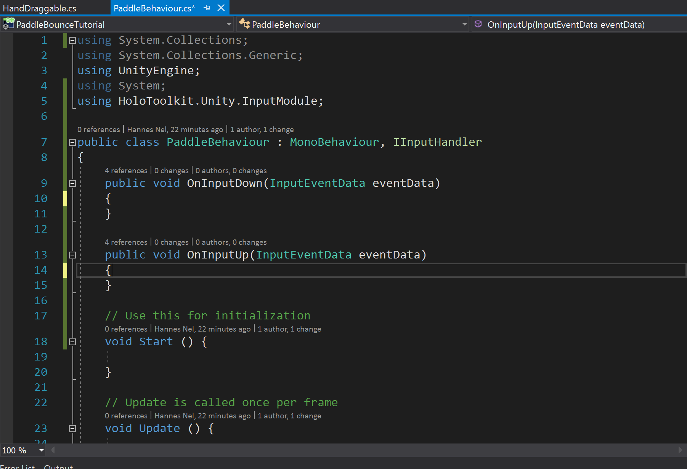

At this point you should now have a HoloLens app with a sphere hanging in
mid-air. Not particularly exciting, and definitely a far-cry from a top100 app
store title. Let’s see how to make it a bit more interactive, and inch closer to
our goals. This is one of our longer posts, as there’s a few different things
that we need to pull together to make it work. Future posts will be shorter!

Building a paddle
=================

We can’t have a game called paddle bounce, without a paddle. We have two options
here: we can either import a paddle built for us by a 3d modeler, or build our
own. You can find some in the Unity Asset store, or import one from a file
exported from 3d modeling software like Blender, Maya or others. In this case,
we’ll start simple, by creating a paddle out of some 3d primitives. Later in the
tutorial series, we’ll replace it with a better looking one, built by someone
with actual 3d modeling skills.

We’ll start by right clicking on our Main scene object in the hierarchy view,
and in the context menu click GameObject -\> 3D Object -\> Cylinder. Now Rename
the cylinder to Paddle, by right clicking on the object in the hierarchy, and
clicking the rename item. Now change the values in the transform component of
the paddle so the position is 0, -0.3,1 (x,y,z). It’s also rather large at the
moment, so we’ll flatten it out by setting the values for scale to 0.15, 0.0057,
0.164. By the way, this matches the official measurements for the blade size of
a table tennis paddle, but not the shape. Your paddle should now look like this:

Try double clicking on the paddle in the hierarchy view to center it in your
scene view, and use the xyz gizmo to spin the view around the various axis. The
scene view can be a pretty powerful way to understand exactly where things are
in your 3d space relative to each other, but it takes a bit of training to
efficiently manipulate it. Check out the [Scene View
page](https://docs.unity3d.com/Manual/SceneViewNavigation.html) in Unity Manual
for more info.

To graduate from disc to paddle, we need a handle. This time we’ll right click
on the paddle object in the hierarchy, and add a capsule as a child object.
We’ll rename it to Handle, and set the position in the transform to 0, 0, -0.7,
the rotation to 90,0,0 and the scale to 0.2, 0.5, 4. As you change the values,
notice how the object changes in the scene view. See anything weird? The numbers
don’t make sense. If 1 unit = 1 meter, 0.2 should be 20cm, but it’s
significantly smaller than that in this case. The reason for that is because the
handle is a child object of the paddle, and thus all the values in this
transform are relevant to the total size of the parent. So instead of the size
along the x axis being 20cm, it is 20% of the width of the disc. The disc is
15cm, so the paddle is 3cm (15 \* 0.2). Also, because we rotated the paddle by
90 degrees around the x-axis, the y and z axis is now swapped. Increasing the
value of the z-axis doesn’t change the length of the handle, as we’d expect, but
rather the height. The length is now governed by the value in the y-axis. This
might sound complicated, but as long as you keep a close eye on the scene view,
you can easily figure out what’s doing what as you manipulate the values.

Your paddle should now look something like this:

If you press the play button, then drag the mouse down while holding the right
mouse button in the game view, your camera should pivot down, allowing you to
see your paddle perfectly placed beneath your ball. What makes it possible for
us to control the camera like that, you might ask? This is one of the many
benefits of using prefab objects from the toolkit. In the hierarchy view, expand
the HoloLensCamera object, and then the GazeControls object beneath it. Beneath
that, you’ll see a bunch other objects. Each one has a script component in its
inspector view, with some values assigned to it. These scripts control how you
manipulate the camera, based on the values of the parameters. It can be
constructive to look at the code behind that. To do so, select the
MouseXYRotationAxis object, and click on the AxisController box in the inspector
view. It will navigate to, and highlight the script in the project view. Double
clicking on the script will launch Visual Studio, and open the script for you to
view.

This is a good time to deploy your app again to your HoloLens, and have a look
around these things. Follow the instructions in Part 2 to do so.

Let’s move the paddle
=====================

Ok so we’ve got a ball and a paddle, how do we make them move? Luckily, most of
what we need is already provided in the Mixed Reality toolkit, so we don’t need
to write a huge amount of code. We’ll start by adding another GameObject to the
hierarchy view, using the Create Empty item in the context menu when you right
click on the Main scene object, and click GameObject. Now rename this object to
Managers.

Next, we’ll add an input manager from the toolkit to our scene. Type
*inputmanager* into the search box in the project view. Now drag the
inputmanager prefab (the blue cube) from the project view onto your managers
view:

The InputManager is an integral part of a hololens app. It will take care of
passing events, like air-tapping, to the object you’re currently looking at. If
you expand the InputManager object, you’ll see there’s again a number of child
objects like the GestureInput, and components like the Gaze Manager. These all
work together to provide you with a pretty flexible input system. It also allows
you to simulate the gestures used in a HoloLens app in the editor. Press the
play button, and you’ll now see two images of hands at the bottom of your view.
These represent your hands. Holding spacebar, will transfer control of the right
hand to your mouse. Left click to air-tap while your hand is active, and you
should see the hand icon do an animation. Use left shift to control the left
hand. If you don’t see the hand icons appear, check that the position transform
for the input manager and the managers object you created, is set to 0, 0, 0.

It’s also useful to provide a cursor for users to know what they’re currently
looking at. We’ll add one form the toolkit that provides feedback when the
hololens can see the user’s hand with their finger ready for an air-tap. In the
project view, search for the interactivemeshcursor prefab, and drag it into your
project view. Again, the prefab will have the blue cube icon:

If you press play again, you’ll now see a cursor that hugs the surface of things
you look at. It also changes shape when you press shift to select your hand
(bigger donut), and when you left click to air-tap (smaller dot).

Great, we can now see what our hands are doing, and where we’re looking. Let’s
put that to use! Select the paddle object in the hierarchy, and scroll down to
the bottom of the inspector window. Click *Add Component*, and search for *hand
draggable* in the little window that opens. Select the script:

Alternatively, you can also drag the script onto your inspector view, or onto
the object in the Hierarchy view, to add it to the Game Object.

The component has a few variables that you can change, to control its
functionality. Change the value of Distance Scale in the new script component,
to 1. This means that the paddle’s movement will now exactly match your hand
movement. If you use this to move things around larger distances, you’ll
typically want to keep it at 2 or higher, to prevent fatigue. In this case, we
want the paddle to move in an easier to predict and more accurate way.

Now press play again, and try it out. Once the game starts playing, drag your
mouse down holding the right button to pivot the camera, until your cursor is on
the paddle. Let go of the button. Now hold the left shift key, and left mouse
button, and drag your mouse around. The paddle will now follow your mouse, until
you let go of either shift or the mouse button.

This is a great time to rebuild your player, and deploy to your HoloLens again,
to try it in real life. Once you’ve got the app going on your HoloLens, look
around for your paddle, and place the cursor on it. Now hold out your hand and
tap-and-hold, to have the paddle follow your hand.

You’ll notice the paddle orients in the direction your looking when you move it
around. In the Hand Draggable component, play around with the values for
Rotation Mode. For Paddle Bounce, I prefer *Orient Towards User And Keep
Upright.* The game gets a fair bit harder if you don’t keep it upright, as the
ball will bounce off the paddle at an angle.

Notice how the script is only on the parent paddle object, but it also works if
you do something with the handle. That’s because events propagate through the
tree of the game object, until a handler indicates to stop. This is a great time
to have a look inside the Hand Draggable script to see what’s happening, and get
an appreciation for how much the toolkit does for you.

Bouncy Ball Bounce
==================

Right now our ball doesn’t participate in physics, and isn’t subject to gravity.
To give it gravity, we need to add a rigidbody component to it. A Rigidbody
essentially gives it substance, or mass. Select the ball in the hierarchy, and
click *Add Component* in the inspector view. Click *Physics -\> RigidBody*, to
add it.

Now set the mass to 0.0027 and the Drag to 0.1:

Now click the Play button again, and you’ll see your ball fall, and hover just
above your paddle. Hmm that’s not right.The reason the ball hangs in mid-air, is
that the paddle has a capsule collider on it that extends beyond it’s volume.
You can see it by having a look in the scene view, while the game is still
playing:

The green sphere is the outlines of the collidor. The collider is a component
that detects collisions between objects in Unity, and is critical to the physics
system. Without colliders, objects would just pass through each other. In the
inspector view, look for the capsule collider, and deselect the checkbox next to
it. Notice how the ball suddenly falls through the paddle.

We need to change the type of collider on the paddle to better match its shape.
Hit the play button again to stop the game (otherwise your changes won’t be
persisted). Now click the Settings cog, and click *Remove Component*. Now scroll
down, and add another component. In the menu, pick *Physics -\> Mesh Collidor.*
Mesh colliders are great for weird shapes that need to match up, but they can be
computationally very expensive, so should be sued sparingly. It’s often a better
idea to approximate what you need using combinations of the other primitive
collider shapes. If you hit play again, you’ll see the ball now come to rest on
the paddle.

So how do we make it bounce? We need a physic material for our ball and our
paddle. In your project view, right click in the PaddleBounceTutorial folder,
and click *Create -\> Physic Material*. Call it PaddlePhysic. With the pysic
selected, change the values in the inspector panel for Dynamic and Static
friction to 0.1, and the Bounciness to 1.

Now add it to the Material field on the paddle’s Mesh Collidor.

Do it again, but this time call it BallPhysic, and add it to the Sphere collider
on your ball.

Hit play again, and you’ll see your ball bounce a few times before falling
through the paddle. The reason for this is that the default settings aren’t
great for fast-moving objects. We need to change the Collision Detection field
on the rigid body to *Continous Dynamic* for the ball.

Also, our paddle needs to be given a rigidbody to better participate in physics.
We don’t want it to be subject to gravity, so uncheck the *Use Gravity* box.
Because our Hand Draggable script sets its position programmatically, we also
need to check the Is Kinematic box. Unity’s physics engine does optimisations
during runtime does that would incorrectly assume it’s position if that flag is
not set when moving the object. Also set the Collision Detection field to
*Continous Dynamic.*

Press play again, and you’ll notice the ball bouncing much more reliably now.

It’s all about Ball Control
===========================

Finally, time to write some code! We want the ball to start dropping when we
grab the paddle, and return to its original position when we let go of the
paddle.

First, we’ll find the RigidBody on the ball, and disable *Use Gravity*.

We’ll create a script to control the gravity programmatically. In the project
view, select the PaddleBounceTutorial folder in which you’ve saved your main
scene. Right click in the open space next to the scene object, and in the
context menu, click Create -\> C\# Script. Name the script PaddleBehaviour, and
add it to your paddle:

Double-click to open the script up in Visual Studio, so we can edit it.

You’ll notice that in the solution explorer, you’ve got two projects. This is
the Unity Editor project, with your scripts from the assets folder. This is
different from the UWP project that we use to run the app on HoloLens. This
project is executed by the Unity Editor, and rendered in the Game window. This
script runs using Mono, whereas your UWP project uses full .Net Core. It means
that you’ve got to be careful about what code you use here, as not everything in
C\# is supported by the current version of Mono used by Unity. You also don’t
have (easy) access to platform specific APIs here. We’ll do a deeper dive into
that in a future post.

Sometimes your new script isn’t in the project in Visual Studio. If this
happens, try to reload the project.

We’ll tie the paddle into the toolkit’s input system, provided by the
InputManager. To do that, we’ll implement IInputHandler. We need to add it to
the line with the PaddleBehaviour class definition. Next we add a using
statement to the top for using HoloToolkit.Unity.InputModule; You can do that by
pressing the shortcut key *ctrl + .* on the interface name, and selecting the
*Using HoloToolkit…* item from the context menu. To implement the interface,
press the *ctrl + .* shortcut again, and select the *Implement interface* item.
Delete the method bodies throwing the NotImplemented exception. Your code should
now look like this:

IInputHandler is one of a few interfaces that the toolkit looks for whenever you
perform an input action in the app on a game object. If the user looks at the
game object, and does an air-tap, the InputManager will look for any components
in that game object’s tree that implements IInputHandler, and call the
OnInputDown event when the user’s finger goes down. When the user raises their
finger, the InputManager will call the OnInputUp method. This happens
automatically for any object you’re looking at. You can also register for these
events from a component that isn’t being looked at. We’ll do that in a future
post.

We’ll need a reference to the ball’s rigidbody, so let’s add a public field to
the class:

public Rigidbody Ball;

If we switch back to the Unity Editor, you’ll see a little spinning wheel in the
bottom-right corner. This means that Unity is recompiling your code, and
updating the editor with the results. When that is finished, you’ll see the new
ball field in your PaddleBehaviour component on the paddle:

Unfortunately, this only supports using fields, not properties.

Drag the ball object from the Hierarchy view, onto the textbox so it looks like
this.

Alternatively, you can click the circle to the right of the textbox, and select
your ball from the list in the dialog. Because the field is a Rigidbody, only
game objects that have a Rigidbody component can be assigned to it.

Now switch back to Visual Studio.

Add the following to the OnInputDown method’s body, in the PaddleBehaviour
class:

public void OnInputDown(InputEventData eventData)

{

Ball.useGravity = true;

}

This will enable gravity for the ball, making it drop down whenever we grab the
handle.

We would also like to save the ball’s original location and rotation when the
game starts. We’ll create fields to store it:

private Vector3 originalBallPosition;

private Quaternion originalBallRotation;

Looking at the content of the script, you see two methods already populated for
you: Start and Update. Unity has a messaging system that uses reflection to
match these methods with message names. PaddleBehaviour participates in this
messaging system because it inherits from MonoBehaviour. Messages are sent to
GameObjects, and these methods on the components handle them when implemented.
Multiple components can handle the same messages on a game object. This makes it
easy for you to isolate pieces of functionality. There are several pre-defined
messages, like Start and Update. Thanks to the Visual Studio tools for Unity,
you can right click on open space in your file, and click on the *Implement
Unity Messages* item towards the bottom of the context menu, to see a dialog box
containing these standard messages. This dialog box lets you select the messages
you’re interested in, and add their definitions to your code.

The Start method is called whenever our script starts executing, after
everything in the scene has been set up. The update method is called every time
a new frame needs to be rendered. We’re only interested in the start method for
now, to save the location before anything changes.

void Start ()

{

originalBallPosition = Ball.transform.position;

originalBallRotation = Ball.transform.rotation;

}

Note that we can’t just keep a reference to the transform itself, as it will
always return the ball’s current position due to being copied by reference. We
need a *copy* of the *original* values in it, to assign back to it later.
Because the position and rotation are structs, they’ll be copied by value.

Lastly, in the OnInputUp method, we’ll reset the ball and disable gravity again.
Because we’re now moving the ball manually, we’ll need to also enable
IsKinematic while we do so:

public void OnInputUp(InputEventData eventData)

{

Ball.useGravity = false;

Ball.isKinematic = true;

Ball.transform.SetPositionAndRotation(originalBallPosition,
originalBallRotation);

Ball.isKinematic = false;

}

Our file now looks like this:

If we go back to Unity, we can hit the play button to test it out. Our ball
should now start dropping and bouncing when we hold the air-tap down, and return
back to its starting position when we let go of it.

A neat trick to try, is to hit the debug button in Visual studio with the Attach
to Unity target, and place a breakpoint in the OnInputUp method.

Now hit the play button, and air-tap the paddle. When you lift your finger, the
focus will switch to Visual Studio, and you’ll see your breakpoint being hit.
You can now inspect the values of any variables, change the execution flow, and
do other debug related tasks. Very useful to figure out hard problems in your
code.

In Summary
==========

In this post, we’ve seen how to

1.  create the paddle by combining primitive models

2.  enable gravity and physics

3.  write a script

4.  re-use the Mixed Reality Toolkit scripts

5.  tie into the Mixed Reality Tookit’s input system

In our next post, we’ll look at using the HoloLens’ ability to model the world
around us to bounce our ball off the environment.
